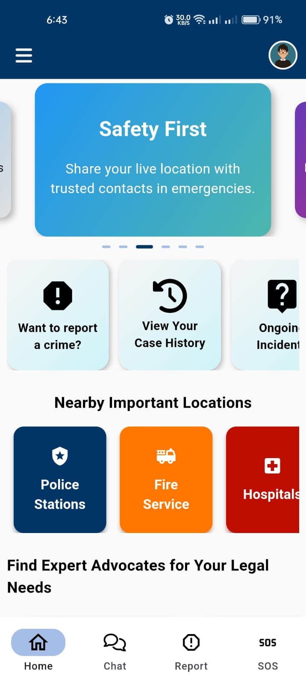

# Guardi-X 🚀
### A Modern Security Solution for Personal and Community Safety

𝐆𝐮𝐚𝐫𝐝𝐢-𝐗 is a security app built with Flutter to help users report crimes, find missing persons or items, share emergency locations, and access legal support. It features real-time chat, accident reporting, an interactive community, important contacts, SOS alerts, and Bangladeshi law details for legal awareness.

---
## 📌 Key Features:
- **Report Crimes:** Report violence, robbery, threats, and more.
- **Interactive Community:** Comment, upvote, downvote, share, and flag reports.
- **Chat:** Real-time chat with trusted contacts.
- **Emergency Location Sharing:** Shake to share live location with family, friends, or police.
- **Accident Reporting:** Upload photos, locations, and descriptions.
- **Legal Support:** View a list of advocates and laws for legal guidance.
- **Important Contacts:** Quick access to emergency numbers.
- **Important Locations:** View nearby police stations, hospitals, etc.
- **Profile Management:** Create, edit, and manage your profile.
- **SOS Feature:** Contact emergency services with a single tap.

---
## 🛠️ Built With:
- **Framework:** Flutter
- **Backend:** Firebase
- **Database:** Firestore
- **Language:** Dart

---
## 🧑‍💻 Developers:
- [Binoy Bhushan Barman Dipu](https://github.com/binoydipu)
- [Md. Ashfak Uzzaman Chowdhury](https://github.com/Ashfak-Uzzaman)

---
## 📸 Screenshots:
<p align="center">
  
  
  
</p>
<p align="center">
  
  
  
</p>
<p align="center">
  
  
  
</p>


---
## 🚀 Installation:
1. **Clone the repository:**
   ```bash
   git clone https://github.com/binoydipu/guardi-x.git
   ```
2. **Navigate to the project directory:**
   ```bash
   cd guardi-x
   ```
3. **Install dependencies:**
   ```bash
   flutter pub get
   ```
4. **Run the app:**
   ```bash
   flutter run
   ```

---
## 📄 License:
This project is licensed under the **MIT License**.

---
## ⭐ Contribute:
We welcome contributions! Feel free to fork the repo and submit pull requests.
